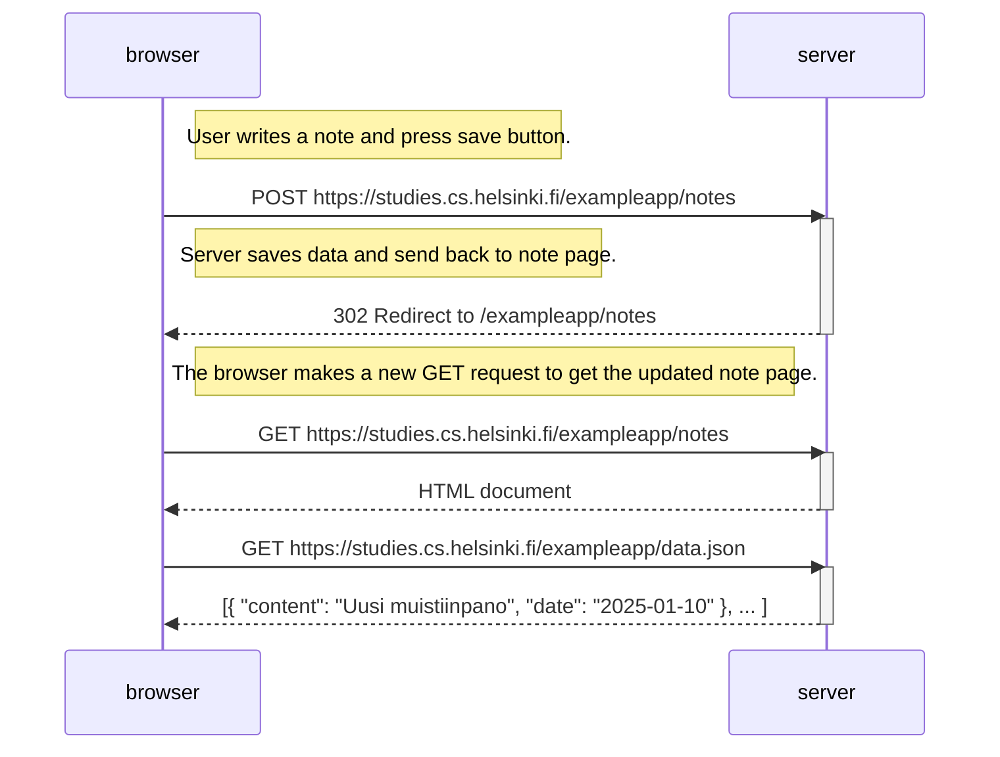

```mermaid

sequenceDiagram
    participant browser
    participant server
    
    Note right of browser: User writes a note and press save button.
    browser->>server: POST https://studies.cs.helsinki.fi/exampleapp/notes
    activate server
    Note right of browser: Server saves data and send back to note page.
    server-->>browser: 302 Redirect to /exampleapp/notes
    deactivate server

    Note right of browser: The browser makes a new GET request to get the updated note page.
    browser->>server: GET https://studies.cs.helsinki.fi/exampleapp/notes
    activate server
    server-->>browser: HTML document
    deactivate server

    browser->>server: GET https://studies.cs.helsinki.fi/exampleapp/data.json
    activate server
    server-->>browser: [{ "content": "Uusi muistiinpano", "date": "2025-01-10" }, ... ]
    deactivate server

```