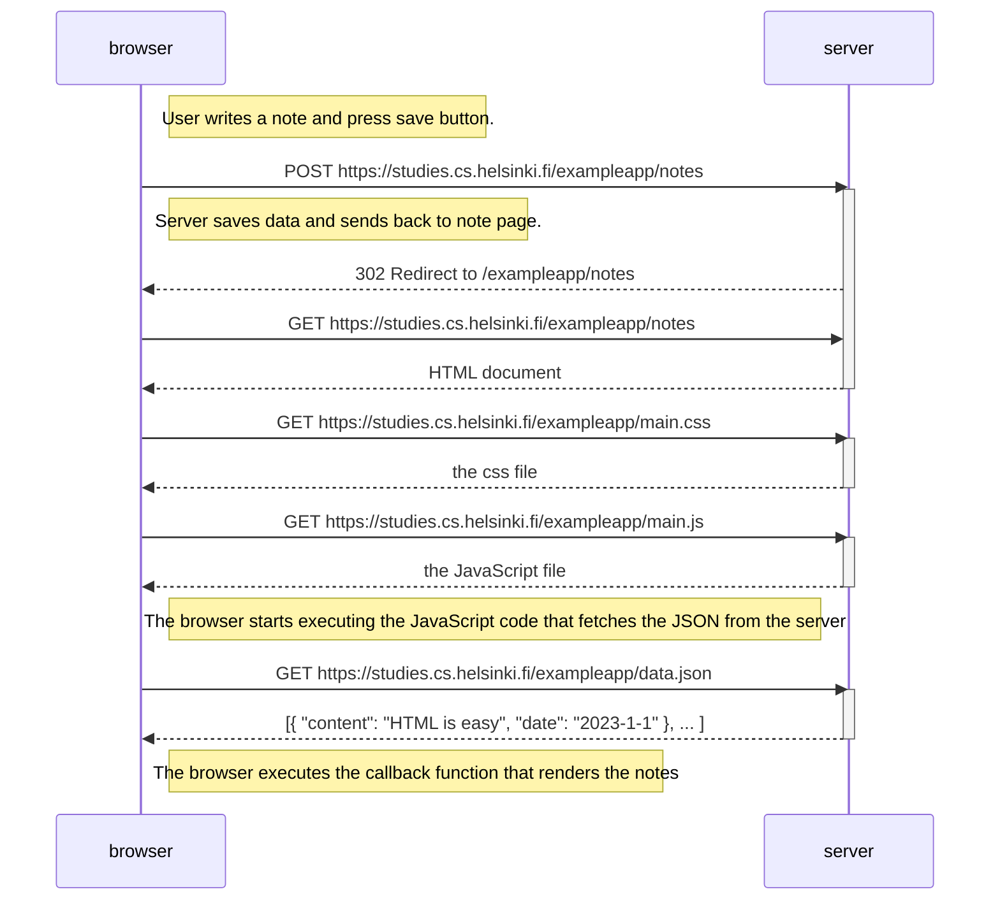

# exercise 0.4 This sequence diagram illustrates the process that occurs when a user creates a new note on the page.

```mermaid

sequenceDiagram
    participant browser
    participant server
    
	Note right of browser: User writes a note and press save button.

    browser->>server: POST https://studies.cs.helsinki.fi/exampleapp/notes
    activate server
	Note right of browser: Server saves data and sends back to note page.

    server-->>browser: 302 Redirect to /exampleapp/notes
    browser->>server: GET https://studies.cs.helsinki.fi/exampleapp/notes
    server-->>browser: HTML document
    deactivate server
    
    browser->>server: GET https://studies.cs.helsinki.fi/exampleapp/main.css
    activate server
    server-->>browser: the css file
    deactivate server
    
    browser->>server: GET https://studies.cs.helsinki.fi/exampleapp/main.js
    activate server
    server-->>browser: the JavaScript file
    deactivate server
    
    Note right of browser: The browser starts executing the JavaScript code that fetches the JSON from the server
    
    browser->>server: GET https://studies.cs.helsinki.fi/exampleapp/data.json
    activate server
    server-->>browser: [{ "content": "HTML is easy", "date": "2023-1-1" }, ... ]
    deactivate server    

    Note right of browser: The browser executes the callback function that renders the notes
```