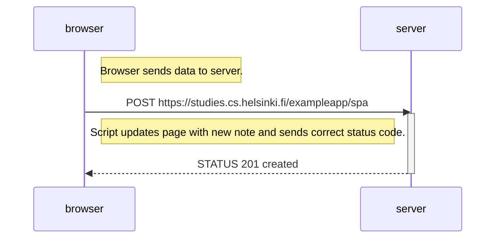

# exercise 0.6 This sequence diagram illustrates the process of creating a new note in the Single Page Application.

```mermaid

sequenceDiagram
    participant browser
    participant server

	Note right of browser: Browser sends data to server.
    
	browser->>server: POST https://studies.cs.helsinki.fi/exampleapp/spa
    activate server
	
	Note right of browser: Script updates page with new note and sends correct status code.

    server-->>browser: STATUS 201 created
    deactivate server

```